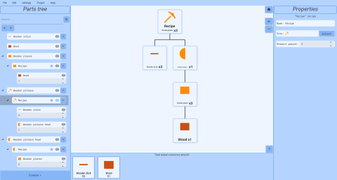

## What is Partlyx?
Partlyx allows you to create schemes (recipes) of varying complexity, consisting of components, which can be any previously created resources.

-----

## What problem does Partlyx solve?

There are many systems in which resources/entities:
* Consist of other resources
* Form deep and branched dependency graphs
* Require visualization and counting of fundamental/basic elements

For example: Production chains, crafts in games, economic models.

Performing such tasks using standard calculators and tables is often either impossible or inefficient, and also not very visual. For example, if we need to change the recipe of one of the frequently used elements, we may need to recalculate its components for all elements that use it.

## How does Partlyx solve this problem?

* It allows describing entities as a dependency graph
* Visualizes multi-level structure
* Calculates total cost/weight/price across the entire graph
* Works with abstract types of resources

The application is tailored not to a specific situation, but to a class of tasks

The application features flexibility and is focused on visual representation of complex structures

-----

## Technical features of the application:

The application is written in C# using Avalonia - a modern cross-platform framework

MVVM structure, divided into 6 layers: Core <- Infrastructure <- Services <- ViewModels <- UI (View), as well as Tests

Applied technologies:
* Dependency Injection for flexibility and modularity
* SQLite for databases
* ReactiveUI for reactivity in View and ViewModels